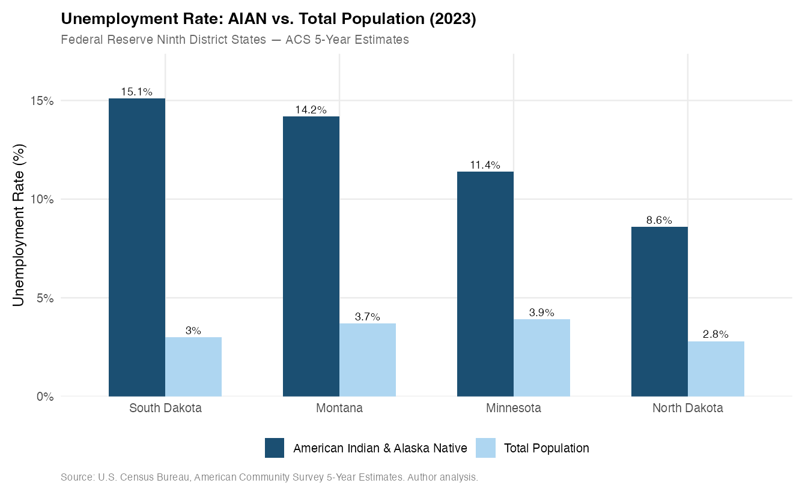
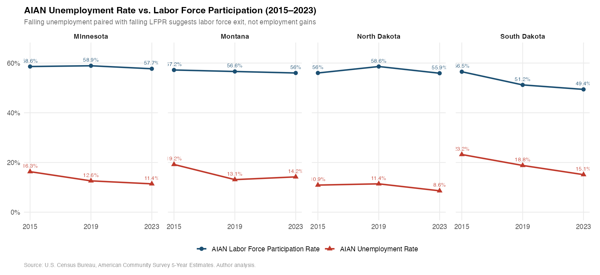
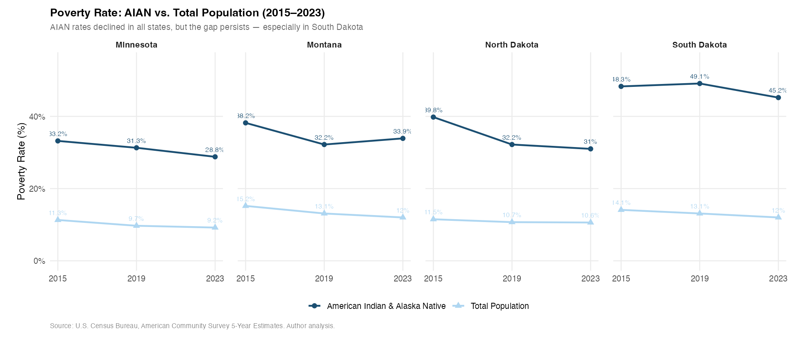
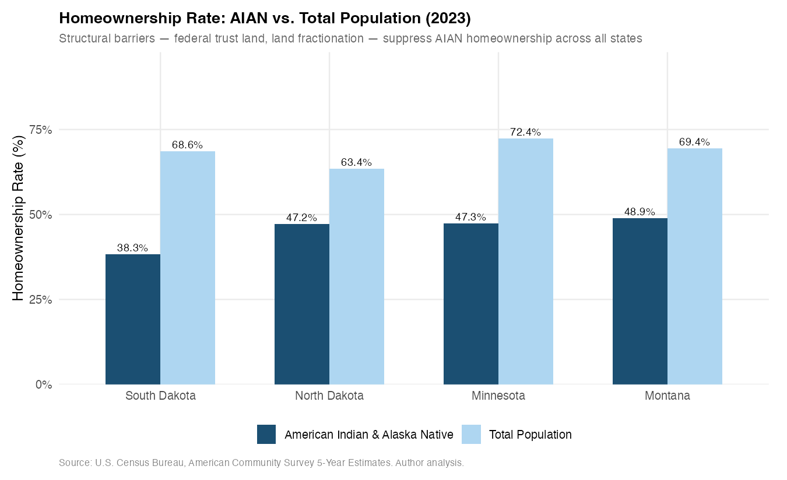
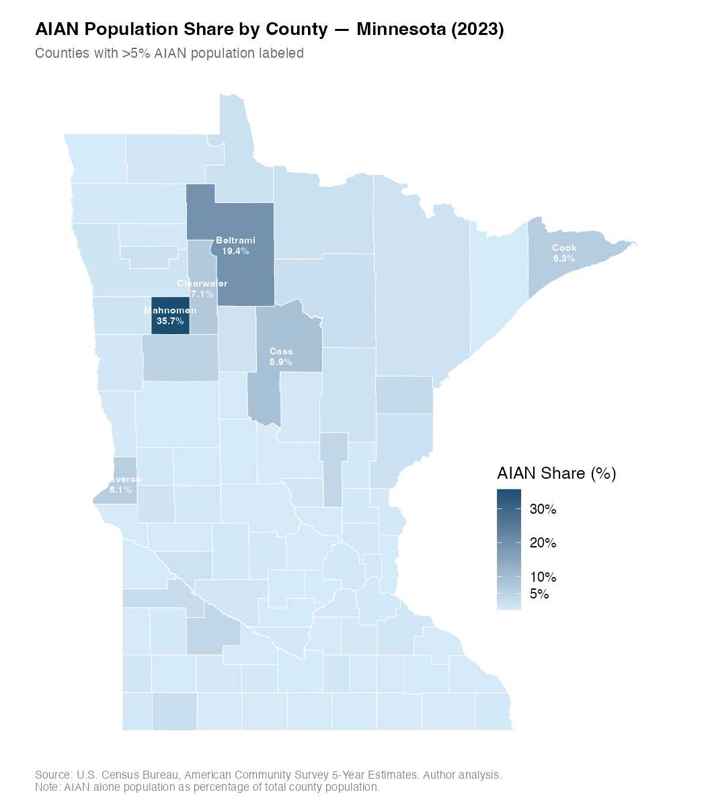

# Economic Conditions in Native American Communities: A Data Portrait

This is an applied data analysis project to observe the socioeconomic disparities between American Indian and Alaska Native (AIAN) populations and the general population across four Federal Reserve Ninth District states: Minnesota, Montana, North Dakota, and South Dakota. In this project, I use U.S. Census Bureau American Community Survey (ACS) 5-year estimates to examine the economic gaps facing by AIAN communities across three aspects: labor markets, poverty and income, and housing — and to assess whether those gaps narrowed, widened, or persisted through three 5-year periods.


## Key Findings

**1. South Dakota: The Widest Disparity Gap** 
In 2023, SD ranked worst across all six disparity dimensions: unemployment gap (12.1 pp), labor force participation rate (LFPR) gap (−18.1 pp), earnings ratio (0.605), poverty gap (33.2 pp), income ratio (0.488), and homeownership gap (30.3 pp). Nearly half of SD's AIAN population lives below the federal poverty line.

**2. Falling unemployment rate may mask labor force exit.** 
AIAN unemployment rate declined in all four states between 2015 and 2023, but labor force participation also declined — most dramatically in South Dakota, where LFPR fell from 56.5% to 49.4%. By 2023, more than half of SD's AIAN working-age population was outside the labor market. Relying solely on unemployment data may overstate economic recovery.

**3. Poverty improved, but gaps persist.** 
While AIAN poverty rates declined across all four states, the disparity gap between AIAN and the total population showed uneven progress. North Dakota (−7.9 pp) and Minnesota (−2.3 pp) saw meaningful gap improvement. In contrast, South Dakota’s gap remained nearly same.

**4. Earnings disparity shows no convergence.** 
AIAN earnings for full-time, year-round workers showed no consistent upward trend between 2015 and 2023. In 2023, earning ratios ranged from 60.5% (SD) to 76.0% (MT) of the total population average income. It is important to note that the true economic gap is likely wider, as these numbers exclude part-time and seasonal workers who are more prevalent in reservation-based economies.

**5. Structural Barriers to Homeownership.** 
The gap in homeownership is structural rather than purely economic. AIAN homeownership rates (38–49%) significantly lower than the total population (63–72%). A primary driver is the federal trust status of reservation land, which prevents its use as collateral. This institutional barrier suppresses homeownership by making conventional mortgages inaccessible, regardless of an individual’s income. While the expansion of CDFIs and specialized lending programs are creating a more inclusive financial infrastructure, their impact is subject to significant lag effects. 

## Data

**Source:** U.S. Census Bureau, American Community Survey 5-Year Estimates (2015, 2019, 2023), retrieved via the `tidycensus` R package.

**Geographic coverage:** Minnesota, Montana, North Dakota, South Dakota (state level) and Minnesota counties (for mapping).

**Three ACS vintages:**

| Vintage | Coverage | Purpose |
|---------|----------|---------|
| 2015 | 2011–2015 | Post-financial-crisis baseline |
| 2019 | 2015–2019 | Pre-pandemic baseline |
| 2023 | 2019–2023 | Most recent; post-pandemic |

**Variables:** 35 Census variables across 13 source tables covering employment status, earnings, poverty, household income, per capita income, housing tenure, and race counts. Full documentation in [CODEBOOK.md](CODEBOOK.md).

## Exhibits

| Figure | Description |
|--------|-------------|
|  | AIAN vs. total unemployment rate, 2023 |
|  | LFPR vs. unemployment trend (2015–2023) — divergence signal |
|  | Poverty rate trend, AIAN vs. total (2015–2023) |
|  | Homeownership rate comparison, 2023 |
|  | Minnesota AIAN population share by county |

## Project Structure

```
cicd-native-economic-portrait/
├── R/
│   ├── 01_data_pull.R       # Census API calls via tidycensus
│   ├── 02_clean.R           # QC, descriptive stats, indicator construction
│   ├── 03_analysis.R        # Trends, pandemic impact, cross-state comparison
│   └── 04_visualize.R       # Five publication-ready exhibits
├── data/
│   ├── raw/                 # 8 .rds files from 01
│   └── clean/               # 4 .rds files from 02
├── output/
│   └── figures/             # 5 .png exhibits from 04
├── CODEBOOK.md              # Variable definitions, formulas, limitations
├── README.md                # This file
└── .gitignore
```

## Installation & Reproducibility

**Prerequisites:** 
Language: R (≥ 4.3)
IDE: RStudio recommended
API: Census API key is required
Libraries: tidyverse, tidycensus, ggplot2, sf, scales

```r
# 1. Install required packages
install.packages(c("tidycensus", "tidyverse", "sf", "scales"))

# 2. Set your Census API key (one-time setup)
census_api_key("YOUR_KEY_HERE", install = TRUE)
readRenviron("~/.Renviron")

# 3. Run scripts in order
source("R/01_data_pull.R")   
source("R/02_clean.R")       
source("R/03_analysis.R")    
source("R/04_visualize.R")   
```

## Limitations

1. Understatement of Labor Exclusion: The ACS "civilian noninstitutional universe" effectively excludes incarcerated individuals. A significant segment of the working-age population is missing from the data, from both numerator and denominator of the function, meaning the findings likely understate the true extent of labor market exclusion, given that AIAN incarceration rates are more than double the national average.

2. Full-Time Employment Bias: By focusing exclusively on full-time, year-round workers, this analysis only captures part of full labor market landscape. In native communities, where seasonal and part-time labor are common due to unique economy structure, this filter likely masks a wider earnings gap. 

3. Limited inflation adjustment: Income comparison across three ACS vintage are not CPI-adjusted while within-vintage ratios partially control for this.

4. Annual volatility was smoothed out: 2023 vintage cannot isolate pandemic peak impact from recovery since the inclusion of 2019. The 2023 data should be viewed as a rolling average of the early 2020s rather than a snapshot of a single year.

5. Causal Ambiguity of Federal Relief: While significant tribal allocations (CARES Act, ARP) occurred during epidemic, the descriptive trend data cannot causally link specific policy interventions to economic outcomes. We acknowledge these "tailwinds" exist, but their precise impact on narrowing gaps remains a subject for further research.

6. A full cost-burden analysis (rent-to-income ratios) was omitted due to the lack of AIAN-specific breakdowns in the ACS tables.


## Author

**Shan Jiang**
[shan.d.jiang@gmail.com](mailto:shan.d.jiang@gmail.com)
